# Site-3-pages-HTML-CSS-ONLY -- ECO'RANDO

Small project, 3 pages, using only HTML & CSS
A project to raise awaireness about forest and activities around it, to appreciate our environment and nature's beauty. 

Sorry for my Frenglish

We will go though this project step by step 🐌

**If you are eager to see the result, clone it or download .zip, extract it and open it in your browser**
## Tree structure :

```
~site-3-pages-HTML-CSS-ONLY
            |__css
            |    |__accueil
            |    |    |__accueil-mobile.css
            |    |    |__accueil.css
            |    |__activite
            |    |    |__activite-mobile.css
            |    |    |__activite.css
            |    |__ecosysteme
            |    |    |__ecosysteme-mobile.css
            |    |    |__ecosysteme.css
            |    |__layout
            |    |    |__footer
            |    |    |    |__footer-mobile.css
            |    |    |    |__footer.css
            |    |    |__header
            |    |         |__header-mobile.css
            |    |         |__header.css
            |    |__style.css
            |__img
            |    |__preparation
            |        |__[...]
            |    |__[...]
            |__pages
            |    |__activite.html
            |    |__ecosysteme.html
            |__index.html
            |__README.md
```

<hr>

## Wireframes

### Desktop

#### Homepage
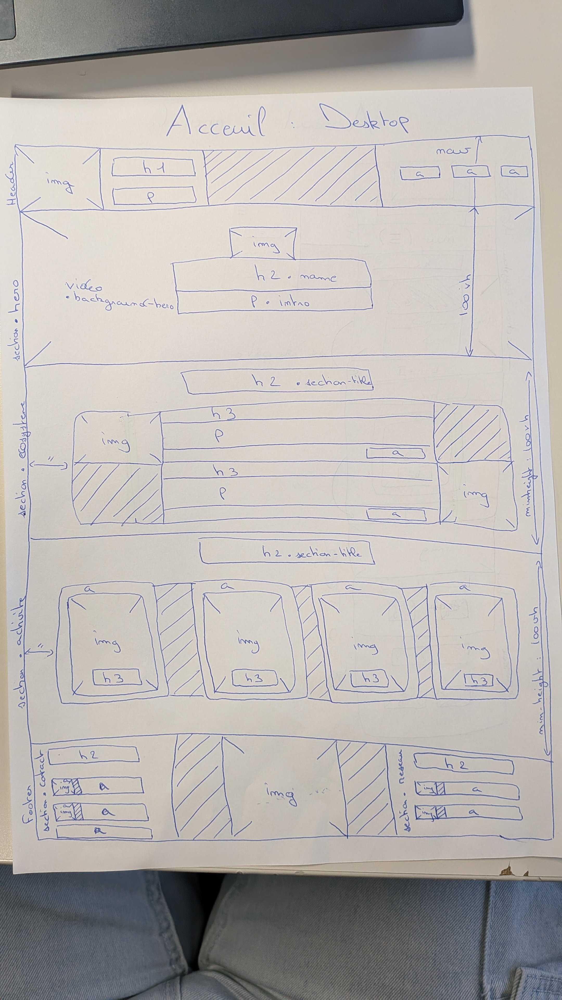
#### Activite
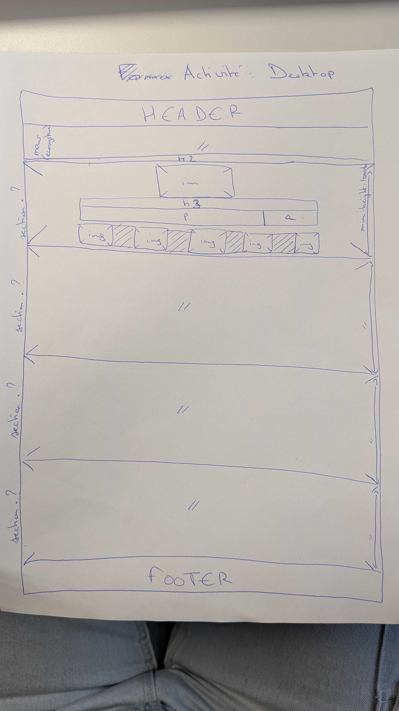
#### Ecosysteme
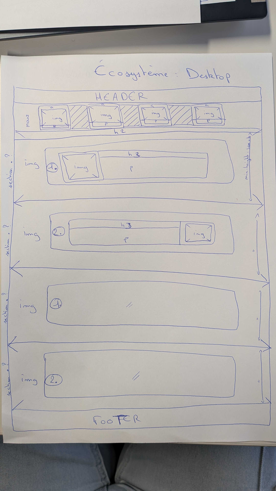

### Mobile

#### Homepage
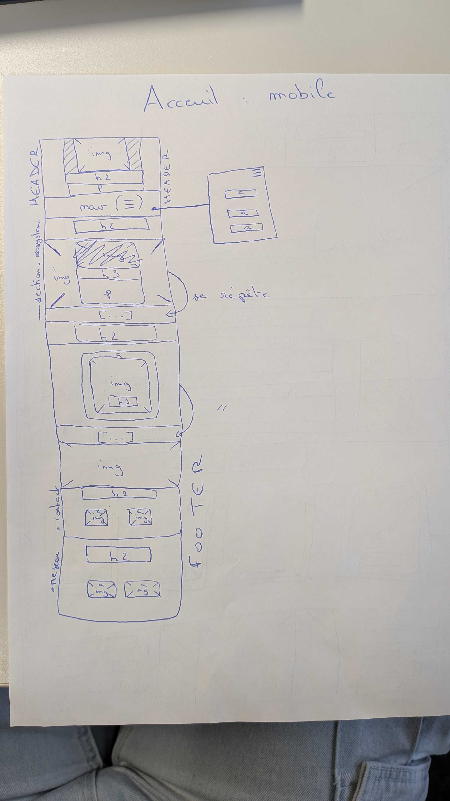
#### Activity
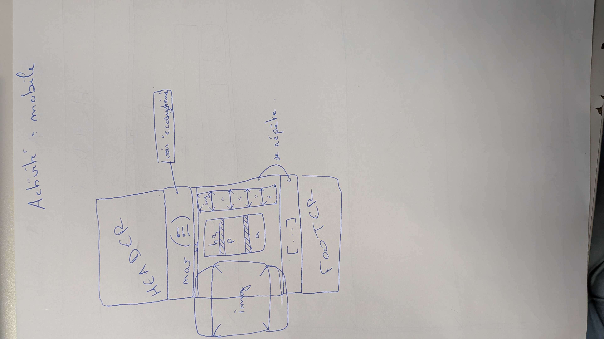
#### Ecosystem
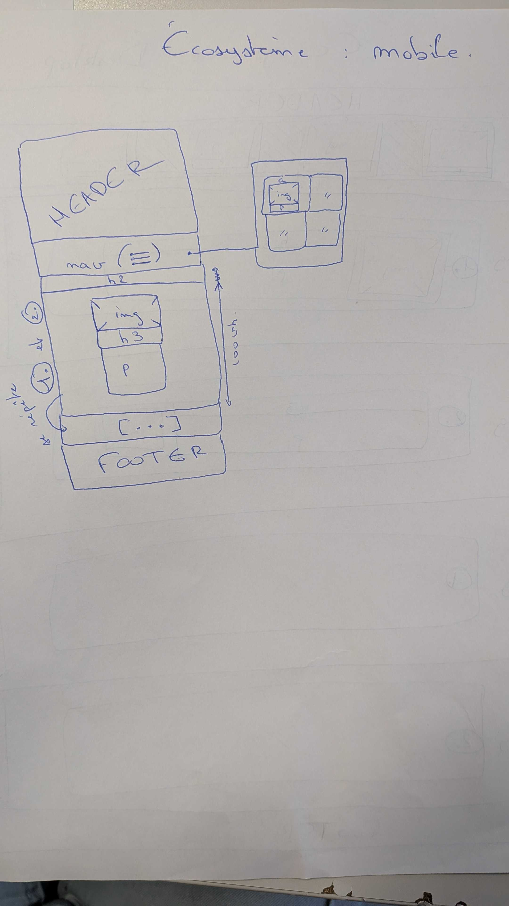

<hr>

## Layout

### Header

```
<header>
    <div class="header-name-logo">
        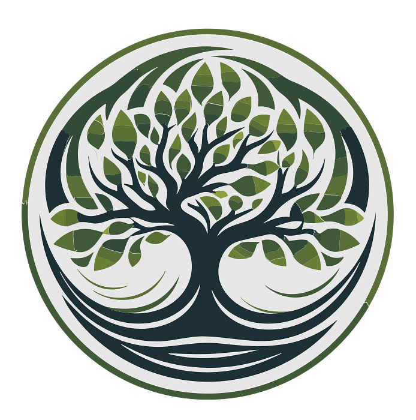
        <h1>Eco'Rando</h1>
        <p>Plus proche de nos forêt, plus proche de nous même</p>
    </div>
    <nav class="header-nav">
        <a href="./index.html" class="btn text-white active">Accueil</a>
        <a href="./pages/activite.html" class="btn text-white">Actvités</a>
        <a href="./pages/ecosysteme.html" class="btn text-white">Écosystème</a>
    </nav>
</header>
```

### Footer

```
<footer class="flex-row-space-between">
    <section class="contact flex-row-space-between">
        <h2>Contact</h2>
        <div class="phone">
            
            <a href="phoneto:0102030405" class="btn btn-text-white">+33 1 02 03 04 05</a>
        </div>
        <div class="email flex-row-space-between">
            
            <a href="mailto:faux.mail@gmail.com" class="btn btn-text-white">faux.mail@gmail.com</a>
        </div>
        <a href="#modal-mentions-légale" class="btn">Mentions légales</a>
    </section>
    
    <section class="reseau">
        <h2>Réseaux sociaux</h2>
        <div class="facebook flex-row-space-between">
            
            <a href="https://www.facebook.com" class="btn btn-text-white">Eco'Rando</a>
        </div>
        <div class="instagram flex-row-space-between">
            
            <a href="https://www.instagram.com" class="btn btn-text-white">@Eco_Rando</a>
        </div>
    </section>
</footer>
```

<hr>

## Accueil

### Hero section

Between \<header> and \<main>

```
<section class="hero">
    <video src="" class="background-hero"></video>
    
    <h2 class="name">ECO'RANDO</h2>
    <p class="intro">La préservation des forêts est notre priorité, profitez gratuitement d'activités physique en groupe le tout en vous instruisant et sensibilisant à la protection de nos forêts, commencez l'aventure !</p>
</section>
```

After that all will be in \<main>

### Ecosystem section

```
<section class="ecosysteme">
    <h2 class="section-title">Notre écosystème</h2>
    <!-- PRESENTATION ARTICLE -->
    <article class="flex-row">
        
        <div class="ecosysteme-text">
            <h3>Eco'Rando</h3>
            <p>
                Fondée en 2026, Eco'Rando est un rassemblement de passionnés de la nature, voués à partager et sensibiliser le plus grand nombre, en commençant avec des programmes pour les plus jeunes jusqu'aux plus anciens cherchant de nouveaux horizons. Pour ceux en capacités des activités sportives en plein air dont randonnées abordées sous un autre angle.
            </p>
            <div class="flex-end">
                <a href="#modal-eco-rando" class="btn btn-full">En savoir plus</a>
            </div>
        </div>
        <div class="emptiness-equal-to-ecosysteme-img"></div>
    </article>
    <!-- REVERSE ARTICLE -->
    <article class="flex-row-reverse">
        
        <div class="ecosysteme-text">
            <h3>Titre</h3>
            <p>
                Lorem, ipsum dolor sit amet consectetur adipisicing elit. Incidunt reiciendis id unde ipsa? Non sit repellendus, facere excepturi ad corrupti tenetur voluptatum at, quo, molestiae deleniti tempora reprehenderit praesentium? Id.
            </p>
            <div class="flex-end">
                <a href="#modal-eco-rando" class="btn btn-full">En savoir plus</a>
            </div>
        </div>
        <div class="emptiness-equal-to-ecosysteme-img"></div>
    </article>
    <!-- NORMAL ARTICLE -->
    <article class="flex-row">
        
        <div class="ecosysteme-text">
            <h3>Titre</h3>
            <p>
                Lorem, ipsum dolor sit amet consectetur adipisicing elit. Incidunt reiciendis id unde ipsa? Non sit repellendus, facere excepturi ad corrupti tenetur voluptatum at, quo, molestiae deleniti tempora reprehenderit praesentium? Id.
            </p>
            <div class="flex-end">
                <a href="#modal-eco-rando" class="btn btn-full">En savoir plus</a>
            </div>
        </div>
        <div class="emptiness-equal-to-ecosysteme-img"></div>
    </article>
    <!-- REVERSE ARTICLE -->
    <article class="flex-row-reverse">
        
        <div class="ecosysteme-text">
            <h3>Titre</h3>
            <p>
                Lorem, ipsum dolor sit amet consectetur adipisicing elit. Incidunt reiciendis id unde ipsa? Non sit repellendus, facere excepturi ad corrupti tenetur voluptatum at, quo, molestiae deleniti tempora reprehenderit praesentium? Id.
            </p>
            <div class="flex-end">
                <a href="#modal-eco-rando" class="btn btn-full">En savoir plus</a>
            </div>
        </div>
        <div class="emptiness-equal-to-ecosysteme-img"></div>
    </article>
</section>
```

### Activity section

```
<section class="activite flex-column-center-center">
    <h2 class="section-title">Activités</h2>
    <nav class="cards-container">
        <!-- CARD RANDO -->
        <a href="./pages/activite.html#rando" class="card">
            <div class="card-content">
                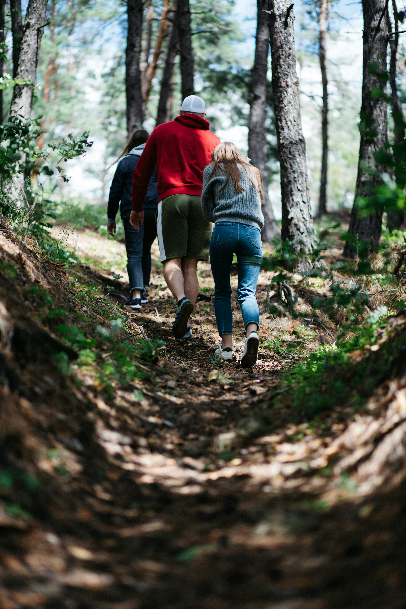
                <h3 class="card-title">Randonnées</h3>
            </div>
        </a>
        <!-- CARD KAYAK -->
        <a href="./pages/activite.html#kayak" class="card">
            <div class="card-content">
                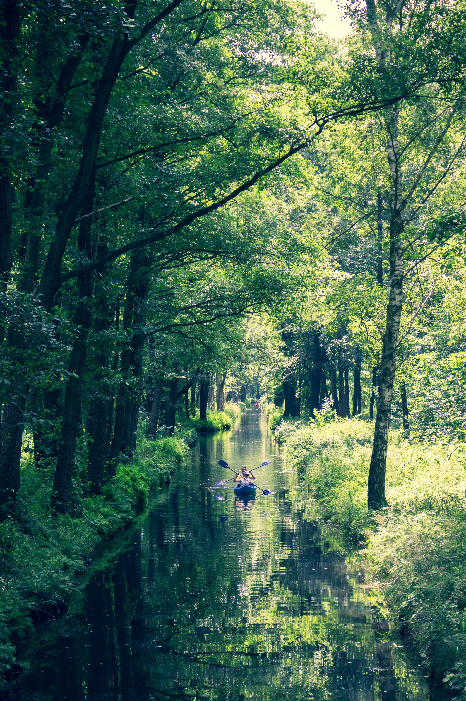
                <h3 class="card-title">Kayak</h3>
            </div>
        </a>
        <!-- CARD KAYAK -->
        <a href="./pages/activite.html#kayak" class="card">
            <div class="card-content">
                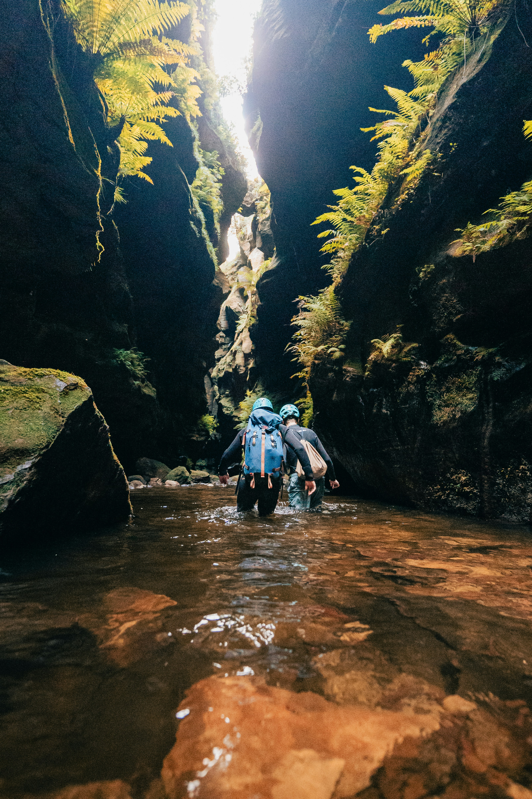
                <h3 class="card-title">Canyoning</h3>
            </div>
        </a>
        <!-- CARD CYCLING -->
        <a href="./pages/activite.html#velo" class="card">
            <div class="card-content">
                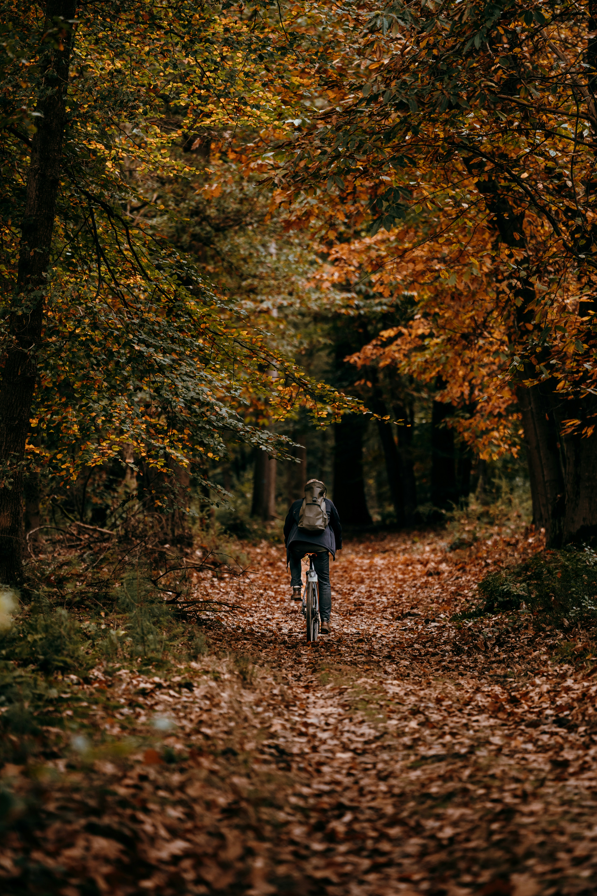
                <h3 class="card-title">Vélo</h3>
            </div>
        </a>
    </div>
</section>
```

<hr>

##

## Special thanks to :
### logos : 
-   [Flaticon](https://www.flaticon.com/fr/) :
    - Freepik,
    - Laisa Islam,
    - ADI_ICONS,

- [Pixabay](https://pixabay.com/fr/) : 
    - Mickeylit,

- [Unsplash](https://unsplash.com/fr) :
    - Josh Fotheringham,
    - Philippe Oursel,
    - Yevhenii Dubrovskyi,
    - Jorgen Hendriksen,